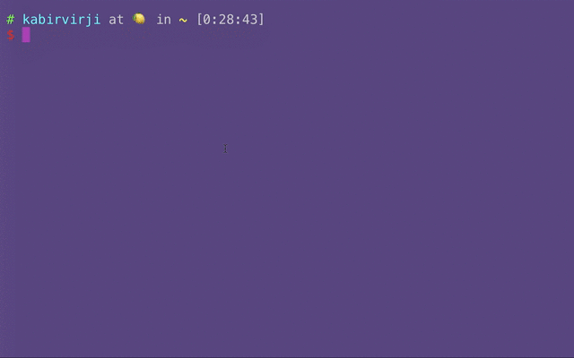

# singlespotify 🎵

> Create Spotify playlists with all of the tracks of an artist through the command line!

Forked from kabirvirji with a different purpose of creating a playlist with all the songs from an artist in order of their release date. 




<!--- 
[](https://asciinema.org/a/4k49ag6gy3bknaa6ryoubhcy5)
-->

## Install
`$ npm install -g singlespotify` <br><br>
**Note:** Node version 7.7.1+ required. `$ node -v` to check which version you have installed. The latest version can be downloaded [here](https://nodejs.org/en/)

## Usage
`$ singlespotify "artist_name"`

The program will then prompt you for your Spotify username and bearer token. <br>

You can get the bearer token here: https://developer.spotify.com/console/post-playlists/ <br>
Click **GET OAUTH TOKEN** and make sure to check *playlist-modify-public* 

`$ singlespotify --help`

```
Usage
      $ singlespotify "artist_name"
      ? Enter your Spotify username <username>
      ? Enter your Spotify bearer token <bearer>

    Options
      --name [-n] "playlist name"    Name of the playlist
      --descending [-d]              Sort the tracks in descending order by release date

    Example
      $ singlespotify "Kanye West" -n "My awesome playlist!"
      ? Enter your Spotify username bradwj
      ? Enter your Spotify bearer token ************************************************************

    For more information visit https://github.com/bradwj/singlespotify
```


